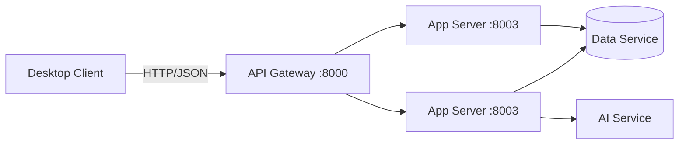

# ✈️ Smart Travel Agent

**Smart Travel Agent** is a modern, AI-powered desktop application that helps users generate personalized travel itineraries. Built with a robust **Microservices Architecture** backend and a polished **PySide6 (Qt)** frontend, it demonstrates a scalable, full-stack implementation of a desktop software solution.

---

## ✨ Key Features

* **AI Trip Generation**: Input your destination, budget, and interests to get a tailor-made 7-day itinerary generated by an LLM.
* **Micro-Frontend Architecture**: The desktop client is built using a modular "Shell + MVP" pattern, allowing for independent development of Authentication, History, and Trip modules.
* **Secure Authentication**: User registration and login handled via a dedicated Gateway and App Server.
* **Trip History**: Save and view your past trip plans (stored securely in MongoDB via Event Sourcing).
* **Modern UI/UX**: Custom-styled Qt widgets, particle animations, and a responsive card-based layout.

---

## 🛠️ Tech Stack

### Frontend (Desktop Client)

* **Framework**: Python (PySide6 / Qt)
* **Architecture**: Modular Monolith (Shell) with Model-View-Presenter (MVP)
* **Styling**: QSS (Qt Style Sheets) & Custom Painted Widgets

### Backend (Microservices)

* **API Gateway**: FastAPI (Reverse Proxy)
* **App Server**: FastAPI (Business Logic & Orchestration)
* **AI Service**: Python (LLM Integration)
* **Data Service**: FastAPI + MongoDB (Persistence)
* **Infrastructure**: Docker & Docker Compose

---

## 🏗️ System Architecture

The system uses a **Gateway Pattern**. The desktop client strictly communicates only with the Gateway on port `8000`.



---

## 🚀 Getting Started

### Prerequisites

* **Docker Desktop** (for running the backend)
* **Python 3.10+** (for running the client)

### 1. Clone the Repository

```bash
git clone https://github.com/yourusername/smart-travel-agent.git
cd smart-travel-agent

```

### 2. Start the Backend (Docker)

The entire backend infrastructure (Gateway, App Server, AI Service, Data Service, Mongo) is containerized.

```bash
docker-compose up --build -d

```

> **Note:** The API Gateway will be available at `http://localhost:8000/doc`.

### 3. Run the Client

Open a new terminal for the client application.

```bash
cd client

# Install dependencies
pip install -r requirements.txt

# Launch the application
python main.py

```

---

## 📂 Project Structure

```text
Smart_Travel_Agent/
├── client/                 # PySide6 Desktop Application
│   ├── core/               # Infrastructure (Shell, EventBus, API Client)
│   ├── components/         # Reusable UI Widgets (ModernInput, ScaleButton)
│   ├── modules/            # Functional Modules (Auth, History, TripForm)
│   └── main.py             # Entry point
│
├── gateway_service/        # Entry point for all backend traffic
├── server/                 # Main Business Logic (App Server)
├── ai_service/             # LLM Integration Logic
├── data_service/           # Database Interface (MongoDB)
└── docker-compose.yml      # Container Orchestration Config

```

---

## 🔧 Troubleshooting

**1. Login fails with "Connection Error"**

* Ensure Docker containers are running (`docker ps`).
* Verify the Gateway is listening on port 8000.

**2. "404 Not Found" when generating a trip**

* This usually means the App Server router isn't registered.
* The `server/main.py` must include `app.include_router(trip_controller.router)`.
* Restart the server: `docker-compose restart app_server`.

**3. UI looks strange / Text is invisible**

* The app uses a Dark Mode theme. Ensure `client/assets/styles.qss` is loaded correctly.
* If inputs are white-on-white, check `view.py` for specific `QPalette` or stylesheet overrides.
